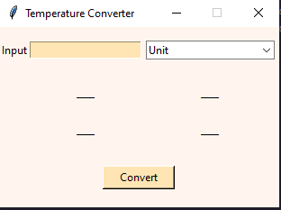
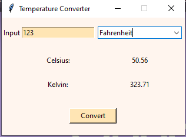

# Temperature Converter

## Overview
A simple temperature converter that converts between Celsius, Fahrenheit, and Kelvin using a user-friendly graphical interface.

## Installation Instructions

1. **Text Editor**:  
   - I used Visual Studio Code (VS Code) for this project. You can download it [here](https://code.visualstudio.com/download).

2. **Python**:  
   - Make sure you have Python installed on your machine. You can download it [here](https://www.python.org/downloads/).
   - To check if Python is installed correctly, open your terminal and run:
     ```bash
     python --version
     ```
   - If you encounter issues, ensure Python is added to your system’s environment PATH.

3. **Clone the Repository**:  
   - Clone this repository to your local machine and open it in your preferred Python editor.

## Run the Project

1. **Clone the Repository**:  
   ```bash
   git clone <repository_url>
   ```

2. **Open the Project**:  
   - Open the cloned repository in your Python editor (e.g., VS Code).

3. **Run the Script**:  
   - Execute the Python script:

     ```bash
    python <script_name>.py
     ```
4. **Test the Application**:  
   - Use the GUI to input a temperature and select a unit to convert.
## Usage

- To use the Temperature Converter:
   
  1. Enter a temperature value in the input field.
   
  2. Choose the unit to convert to (Celsius, Fahrenheit, or Kelvin) from the dropdown menu.
  3. Click the "Convert" button to see the converted values.
## Features

- Handles edge cases to ensure robust functionality.
- Simple yet modular code design for easy maintenance and scalability.
- Converts temperatures accurately between Celsius, Fahrenheit, and Kelvin.


---

*Credit: I have to admit, ChatGPT helped me make this draft as clean as it looks.*